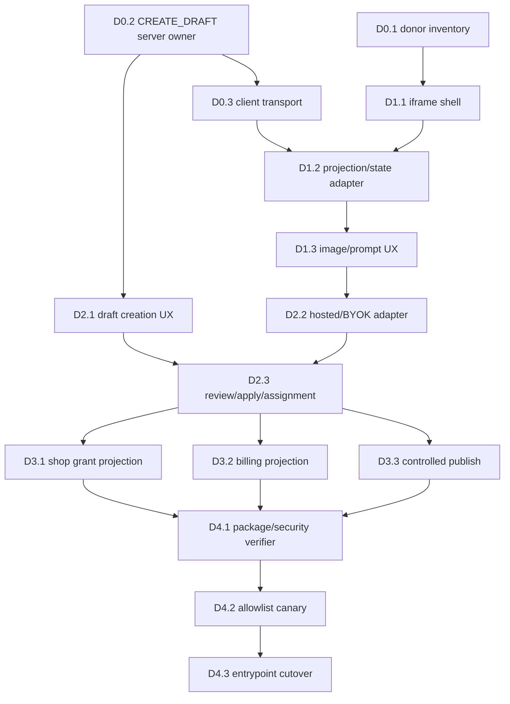

# Donor Migration Dependency Graph

```mermaid
flowchart TD
  D01[D0.1 donor inventory] --> D11[D1.1 iframe shell]
  D02[D0.2 CREATE_DRAFT server owner] --> D03[D0.3 client transport]
  D03 --> D12[D1.2 projection/state adapter]
  D11 --> D12
  D12 --> D13[D1.3 image/prompt UX]
  D02 --> D21[D2.1 draft creation UX]
  D13 --> D22[D2.2 hosted/BYOK adapter]
  D21 --> D23[D2.3 review/apply/assignment]
  D22 --> D23
  D23 --> D31[D3.1 shop grant projection]
  D23 --> D32[D3.2 billing projection]
  D23 --> D33[D3.3 controlled publish]
  D31 --> D41[D4.1 package/security verifier]
  D32 --> D41
  D33 --> D41
  D41 --> D42[D4.2 allowlist canary]
  D42 --> D43[D4.3 entrypoint cutover]
```
